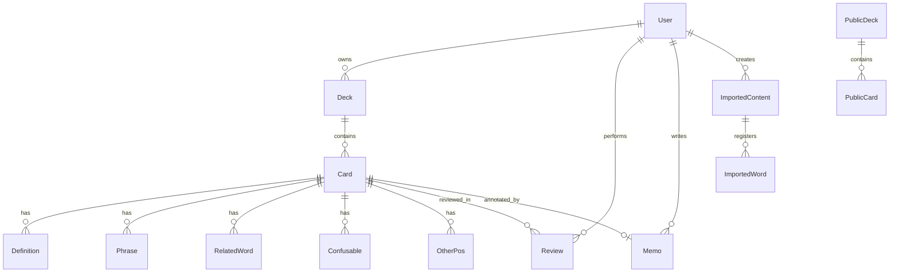

# データモデル / DB 設計書

> 各画面のモックデータから抽出したエンティティ定義です。バックエンド着手時の **スキーマ設計の出発点** として使ってください。
> 全体像は [product.md](./product.md)、画面ごとの表示項目は [screens.md](./screens.md) を参照。

---

## 1. 設計方針

- **コードから観測できる項目を中心に書く**。推測は最小限に抑え、明らかに必要だが画面に出ていないもの（`createdAt` / `userId` 等）は **「観測元」欄に "推測" と明記**
- バックエンド方式（Supabase / Prisma / Cloudflare D1）は **TBD**。型は **RDB 想定の汎用表記**（`text` / `int` / `boolean` / `timestamptz` 等）で記述
- 1 ユーザーが複数デッキを所有し、1 デッキが複数カードを持つ。学習履歴はカード単位
- 公開デッキ（`PublicDeck`）は私有デッキとは別エンティティ。ユーザーがインポートした時点で **複製するか参照するか** は **TBD**
- 1:N の付随情報（複数定義 / フレーズ / 関連語 / 紛らわしい語）は **正規化した子テーブル**として定義。RDB 以外（Document DB 等）を選ぶ場合は埋め込みでも可

---

## 2. ER 図

- `Memo` は 「1 ユーザー × 1 カード」で 0..1 件（ユーザー固有のメモ）
- `PublicDeck` / `PublicCard` の構造はインポート時の取り扱い（複製 or 参照）が決まっていないため、**TBD** セクション参照

---

## 3. User

ユーザープロフィールと設定。観測元: [settings-screen.tsx](../components/screens/settings-screen.tsx)（プロフィール表示部 / 設定セクション）。

| カラム | 型 | NULL | 制約 / 既定 | 観測元 |
| --- | --- | :---: | --- | --- |
| `id` | uuid | × | PK | 推測 |
| `email` | text | × | UNIQUE | プロフィール: `tanaka@email.com` |
| `display_name` | text | × | — | プロフィール: `Tanaka Yuki` |
| `plan` | text | × | `'free'` / `'premium'` | プロフィール: `Premium会員` |
| `dark_mode` | boolean | × | `false` | 設定: ダークモードトグル |
| `tts_language` | text | × | `'en-US'` | 設定: TTS 言語（`英語 (US)`） |
| `reminder_time` | text or time | ○ | 例 `'08:00'` | 設定: リマインダー（`毎日 8:00`） |
| `cloud_sync_enabled` | boolean | × | `true` | 設定: クラウド同期 |
| `streak_days` | int | × | `0` | ホーム/統計: 連続日数（**派生値** — 履歴から計算する想定） |
| `created_at` | timestamptz | × | `now()` | 推測 |
| `updated_at` | timestamptz | × | `now()` | 推測 |

**注**:
- 認証方式（メール / Google / Apple）は **TBD**。プロバイダごとの一意 ID を別テーブル（`UserAuth`）に持つかは方式次第
- `streak_days` は派生値で、`Review` テーブルから日次集計するのが本来。冗長カラムにしてキャッシュするかは運用判断

---

## 4. Deck

ユーザーが所有するデッキ。観測元: [home-screen.tsx](../components/screens/home-screen.tsx)（`decks` 配列）、[deck-detail-screen.tsx](../components/screens/deck-detail-screen.tsx)。

| カラム | 型 | NULL | 制約 / 既定 | 観測元 |
| --- | --- | :---: | --- | --- |
| `id` | uuid | × | PK | `id: "1"` 等 |
| `user_id` | uuid | × | FK → `User.id` | 推測 |
| `name` | text | × | — | `name: "TOEIC 頻出 800語"` |
| `template` | text | × | enum: `'スタンダード'` / `'英単語拡張'` / `'詳細解説付き'` | `template: "スタンダード"` |
| `color` | text | × | Tailwind クラス文字列（`bg-blue-500` 等） | `color: "bg-blue-500"` |
| `total_cards` | int | × | `0` | `cards: 800`（**派生値** — `Card` の COUNT に置換可） |
| `mastered_count` | int | × | `0` | `mastered: 342`（**派生値** — `Review` から算出） |
| `due_today_count` | int | × | `0` | `dueToday: 24`（**派生値** — SRS の次回復習日に基づく） |
| `created_at` | timestamptz | × | `now()` | 推測 |
| `updated_at` | timestamptz | × | `now()` | 推測 |

**注**:
- `total_cards` / `mastered_count` / `due_today_count` は派生値。**正規形にこだわるなら毎回 JOIN+COUNT、性能優先ならカラムに非正規化** の二択
- `color` は Tailwind クラスを直接保持しているが、テーマトークン化（`'blue'` / `'emerald'` のような色名のみ保存）すれば多プラットフォーム化に強くなる
- `template` は現状文字列リテラル。**カードのスキーマを動的に切り替えるか単にラベル扱いか** は **TBD**

---

## 5. Card

デッキ内の 1 枚のカード。観測元: [flashcard-screen.tsx](../components/screens/flashcard-screen.tsx) の `WORDS` 配列（最も詳細）と [deck-detail-screen.tsx](../components/screens/deck-detail-screen.tsx) / [card-list-screen.tsx](../components/screens/card-list-screen.tsx) の簡易版。

### 5.1 メインテーブル

| カラム | 型 | NULL | 制約 / 既定 | 観測元 |
| --- | --- | :---: | --- | --- |
| `id` | text or uuid | × | PK（`"0001"` のような連番文字列のままなら text） | `id: "0001"` |
| `deck_id` | uuid | × | FK → `Deck.id` | 推測 |
| `word` | text | × | — | `word: "premium"` |
| `pronunciation` | text | ○ | IPA 等 | `pronunciation: "/ˈpriːmiəm/"` |
| `pos` | text | ○ | 品詞略号（`名` / `動` / `形` / `副` ...） | `pos: "名"` |
| `meaning` | text | × | 主要な意味 1 つ（一覧表示用の代表） | `meaning: "保険料"` |
| `category` | text | ○ | 例: `"ビジネス問題"` | `category: "ビジネス問題"` |
| `example` | text | ○ | 英語例文 | `example: "I paid over $3,000..."` |
| `example_highlight` | text | ○ | 例文中でハイライトする部分文字列 | `exampleHighlight: "premiums"` |
| `example_ja` | text | ○ | 例文の日本語訳 | `exampleJa: "私は年間の..."` |
| `etymology` | text | ○ | 語源説明 | `etymology: "ラテン語 praemium..."` |
| `mnemonic` | text | ○ | 記憶術 / 語呂合わせ | `mnemonic: "「プレミアム」なビール..."` |
| `root_image` | text | ○ | 意味の根本イメージ | `rootImage: "「pre-（前に）..."` |
| `mastery` | int | × | `1`〜`5`、既定 `1` | `mastery: 4`（[card-list-screen.tsx](../components/screens/card-list-screen.tsx)） |
| `flagged` | boolean | × | `false` | `flagged: true` |
| `explanation` | text | ○ | 一覧表示用の短い解説 | `explanation: "前例が全くないこと"`（[card-list-screen.tsx](../components/screens/card-list-screen.tsx)） |
| `created_at` | timestamptz | × | `now()` | 推測 |
| `updated_at` | timestamptz | × | `now()` | 推測 |

**注**:
- `mastery` は SRS の出力値。**派生値として持たせるか実体カラムにするかは TBD**（現状 UI はカード自身の属性として扱っている）
- `meaning` と `definitions[]` の関係: `meaning` はカードの代表意味、`definitions` は品詞ごとの全意味リスト。一覧表示用に `meaning` をキャッシュしておく構造が妥当
- `explanation` は [card-list-screen.tsx](../components/screens/card-list-screen.tsx) のみで観測されるフィールド。フラッシュカード側 (`memo` / `etymology`) との整理は **要検討**

### 5.2 子テーブル: `Definition`（複数定義）

`WORDS[*].definitions: { pos, items: string[] }[]` から正規化。

| カラム | 型 | NULL | 制約 |
| --- | --- | :---: | --- |
| `id` | uuid | × | PK |
| `card_id` | uuid | × | FK → `Card.id` |
| `pos` | text | × | 品詞 |
| `items` | text[] or jsonb | × | 同品詞内の意味の配列（`["保険料", "割増金、プレミアム", ...]`） |
| `order` | int | × | 表示順 |

RDB なら `text[]` ではなく **更に正規化して `DefinitionItem` テーブルにする** のも選択肢。jsonb で持つ場合はインデックス不要で扱いやすい。

### 5.3 子テーブル: `Phrase`（フレーズ）

`WORDS[*].phrases: { en, ja }[]`。

| カラム | 型 | NULL | 制約 |
| --- | --- | :---: | --- |
| `id` | uuid | × | PK |
| `card_id` | uuid | × | FK → `Card.id` |
| `en` | text | × | 例: `"car insurance premiums"` |
| `ja` | text | × | 例: `"自動車保険の保険料"` |
| `order` | int | × | 表示順 |

### 5.4 子テーブル: `RelatedWord`（同じ語源の単語）

`WORDS[*].relatedWords: { word, pos }[]`。

| カラム | 型 | NULL | 制約 |
| --- | --- | :---: | --- |
| `id` | uuid | × | PK |
| `card_id` | uuid | × | FK → `Card.id` |
| `word` | text | × | 関連語 |
| `pos` | text | ○ | 品詞 |
| `order` | int | × | 表示順 |

### 5.5 子テーブル: `OtherPos`（他の品詞での意味）

`WORDS[*].otherPos: { pos, meaning }[]`。

| カラム | 型 | NULL | 制約 |
| --- | --- | :---: | --- |
| `id` | uuid | × | PK |
| `card_id` | uuid | × | FK → `Card.id` |
| `pos` | text | × | 品詞 |
| `meaning` | text | × | その品詞での意味 |
| `order` | int | × | 表示順 |

### 5.6 子テーブル: `Confusable`（紛らわしい単語）

`WORDS[*].confusables: { word, meaning, why }[]`。

| カラム | 型 | NULL | 制約 |
| --- | --- | :---: | --- |
| `id` | uuid | × | PK |
| `card_id` | uuid | × | FK → `Card.id` |
| `word` | text | × | 似ている単語 |
| `meaning` | text | × | その単語の意味 |
| `why` | text | × | 紛らわしい理由（`"スペルが似ている"` など） |
| `order` | int | × | 表示順 |

---

## 6. Review（学習履歴 / SRS 状態）

学習セッションでカードを 1 回見たことの記録 + SRS の次回間隔計算用の状態を保持。観測元: [results-screen.tsx](../components/screens/results-screen.tsx)（`from → to` の習熟度変化）、[stats-screen.tsx](../components/screens/stats-screen.tsx)（`ef` / `reviews` 表示）、[home-screen.tsx](../components/screens/home-screen.tsx) / [deck-detail-screen.tsx](../components/screens/deck-detail-screen.tsx)（`dueToday`）。

### 6.1 履歴: `ReviewLog`（イベント）

| カラム | 型 | NULL | 制約 / 既定 |
| --- | --- | :---: | --- |
| `id` | uuid | × | PK |
| `user_id` | uuid | × | FK → `User.id` |
| `card_id` | text/uuid | × | FK → `Card.id` |
| `mode` | text | × | `'flashcard'` / `'quiz'` |
| `correct` | boolean | × | クイズの正誤。フラッシュカードでは「思い出せた=true」を入れるか **TBD** |
| `mastery_before` | int | × | 1〜5 |
| `mastery_after` | int | × | 1〜5 |
| `reviewed_at` | timestamptz | × | `now()` |

`results-screen.tsx` の `masteryChanges: { word, from, to }[]` から `mastery_before` / `mastery_after` が来ている。

### 6.2 状態: `CardSrsState`（カード × ユーザーの最新 SRS 状態）

[stats-screen.tsx](../components/screens/stats-screen.tsx) の苦手カード TOP5 で観測される `ef` / `reviews` を保持する状態テーブル。

| カラム | 型 | NULL | 制約 / 既定 |
| --- | --- | :---: | --- |
| `card_id` | text/uuid | × | PK 構成 1 |
| `user_id` | uuid | × | PK 構成 2 |
| `ease_factor` | numeric(3,2) | × | 既定 `2.5`（SM-2 既定値）。**TBD: アルゴリズム選定後に確定** |
| `interval_days` | int | × | 次回復習までの日数 |
| `repetitions` | int | × | これまでの正解連続回数 |
| `reviews_total` | int | × | 累計復習回数（[stats-screen.tsx](../components/screens/stats-screen.tsx) `reviews: 8`） |
| `next_review_at` | timestamptz | × | 次回復習予定日時 |
| `mastery` | int | × | 1〜5（最新値、`Card.mastery` と同期 or 派生） |
| `updated_at` | timestamptz | × | `now()` |

**注**:
- アルゴリズム（**SM-2 / FSRS / 自作**）は **TBD**。`ease_factor` / `interval_days` / `repetitions` は SM-2 の最低限のフィールド構成
- `Card.mastery` を残すか、`CardSrsState.mastery` のみ正とするかは要決定（前者は読み取り簡単、後者は正規化的）

---

## 7. Memo（カードへの自由メモ）

観測元: [flashcard-screen.tsx](../components/screens/flashcard-screen.tsx) の `memos: Record<cardId, string>`。

| カラム | 型 | NULL | 制約 / 既定 |
| --- | --- | :---: | --- |
| `id` | uuid | × | PK |
| `user_id` | uuid | × | FK → `User.id`、UNIQUE (`user_id`, `card_id`) |
| `card_id` | text/uuid | × | FK → `Card.id` |
| `content` | text | × | 自由記入 |
| `updated_at` | timestamptz | × | `now()` |

[card-edit-screen.tsx](../components/screens/card-edit-screen.tsx) の `memo` フィールドと **同じものか別物か** は **要決定**。前者はカード編集時のメモ、後者はフラッシュカード裏面で書ける個人メモなので、設計上は分けた方が安全。

---

## 8. PublicDeck（公開デッキ）

観測元: [explore-screen.tsx](../components/screens/explore-screen.tsx) の `publicDecks` 配列。

| カラム | 型 | NULL | 制約 / 既定 |
| --- | --- | :---: | --- |
| `id` | uuid | × | PK |
| `name` | text | × | `"TOEIC 900点突破 必須単語"` |
| `author` | text | × | 著者表示名（`"StudyMaster"`） |
| `total_cards` | int | × | `cards: 500` |
| `downloads` | int | × | `0` |
| `rating` | numeric(2,1) | × | 0.0〜5.0 |
| `category` | text | × | enum: `'英語'` / `'資格'` / `'ビジネス'` / `'IT'` / `'医学'` / `'法学'` |
| `description` | text | ○ | 推測（UI には未表示） |
| `created_at` | timestamptz | × | `now()` |

カテゴリ一覧は [explore-screen.tsx](../components/screens/explore-screen.tsx#L6) の `categories` 配列で管理されている（先頭の `"すべて"` はフィルタ用 UI 値で、カテゴリ実体ではない）。

`PublicDeck` 配下のカードを `PublicCard` として持つか、ユーザーがインポートしたタイミングで `Card` を複製するかは **TBD**（[10. 未確定事項](#10-未確定事項tbd)）。

---

## 9. ImportedContent（外部ソース取込）

観測元: [import-screen.tsx](../components/screens/import-screen.tsx)。

### 9.1 メイン: `ImportedContent`

| カラム | 型 | NULL | 制約 / 既定 |
| --- | --- | :---: | --- |
| `id` | uuid | × | PK |
| `user_id` | uuid | × | FK → `User.id` |
| `source_type` | text | × | enum: `'pdf'` / `'podcast'` / `'youtube'` |
| `source_url` | text | ○ | URL（PDF の場合は保存先パス）|
| `title` | text | ○ | 動画 / Podcast タイトル（推測） |
| `duration_seconds` | int | ○ | `totalDuration: 100` |
| `transcript` | jsonb | × | `TranscriptLine[]` を埋め込み（下記 9.2 参照） |
| `created_at` | timestamptz | × | `now()` |

トランスクリプトを別テーブルにするか jsonb で埋め込むかは **書き込みパターン次第**:
- イミュータブル（取得後に編集しない）なら jsonb 埋め込みが楽
- 行ごとの編集 / 検索が必要なら別テーブル

### 9.2 トランスクリプト 1 行（埋め込み構造 or 子テーブル）

| フィールド | 型 | NULL | 説明 |
| --- | --- | :---: | --- |
| `time` | int | × | 開始秒（`time: 0`、`12`、...） |
| `en` | text | × | 英文 |
| `ja` | text | × | 日本語訳 |

### 9.3 子: `ImportedWord`（登録単語）

`registeredWords: { word, sourceIndex }[]` から。

| カラム | 型 | NULL | 制約 |
| --- | --- | :---: | --- |
| `id` | uuid | × | PK |
| `imported_content_id` | uuid | × | FK → `ImportedContent.id` |
| `word` | text | × | 登録単語（lowercase 化済み） |
| `source_line_index` | int | × | トランスクリプトの行インデックス |
| `card_id` | uuid | ○ | デッキへ登録後の `Card.id`。未登録は NULL |
| `created_at` | timestamptz | × | `now()` |

UNIQUE (`imported_content_id`, `word`, `source_line_index`) — 同じ語が複数行で出てきたら別レコードを許容。

### 9.4 辞書（参考）

[import-screen.tsx](../components/screens/import-screen.tsx) の `mockMeanings: Record<string, string>` は約 30 単語のハードコード辞書。本実装では:
- 辞書 API を呼ぶ（外部 / 自前 / Claude）
- 既存の `Card` に同じ word があれば再利用

のどちらかを選ぶ必要があり、**TBD**。

---

## 10. 未確定事項（TBD）

意思決定が必要な項目を集約。決まったら本ドキュメントに反映する運用。

| 項目 | 影響範囲 | 補足 |
| --- | --- | --- |
| **バックエンド方式** | スキーマ全体 | Supabase / Next.js Route Handlers + Prisma + PostgreSQL / Cloudflare Workers + D1 が候補。Capacitor で iOS 化することを踏まえると **HTTPS で叩ける REST/RPC** が無難 |
| **SRS アルゴリズム** | `CardSrsState` / `Review` | SM-2（実装が軽い）/ FSRS（精度高い）/ 自作。`ease_factor` / `interval_days` / `repetitions` の意味は SM-2 を念頭に書いている |
| **認証方式** | `User` / 別途 `UserAuth` | メール / Google / Apple Sign In。iOS 公開なら Apple Sign In が必須 |
| **AI 機能の範囲** | `Card.etymology` / `Card.mnemonic` / `Card.explanation` の生成元、[import-screen.tsx](../components/screens/import-screen.tsx) の書き起こし | Anthropic Claude API 想定。プロンプトの仕様書は今回作らない |
| **AI 生成結果のキャッシュ** | コスト面 | 同じ単語に対する生成結果を `Card` に書き戻すか、別テーブルでキャッシュするか |
| **公開デッキインポート時の取り扱い** | `Deck` / `PublicDeck` の関係 | 取込時に `Card` を **複製**（後で編集可、独立進捗）するか、`PublicCard` を **参照**（更新追従するが個別編集不可）するか |
| **`Card.mastery` と `CardSrsState.mastery` の整合** | データ正規化 | どちらかを正にしてもう片方は廃止 / 派生にすべき |
| **`Memo` と `Card.memo` の使い分け** | UI / API 設計 | カード共通の解説と、ユーザー固有のメモを分けて持つかどうか |
| **デッキの `color` の扱い** | テーマ移植性 | Tailwind クラス保存 vs 色名トークンのみ保存 |
| **テンプレート (`Deck.template`)** | カードフィールド構成 | ラベルだけか、カードのフィールド構成を実際に切り替えるか |
| **トランスクリプト保存形式** | `ImportedContent` | jsonb 埋め込み vs 別テーブル正規化 |
| **`User.streak_days` のキャッシュ** | パフォーマンス | カラム化 vs クエリ時集計 |
| **API 設計書（別ドキュメント）** | 認証 / フロント連携 | バックエンド方式が決まり次第、`docs/api.md` を別途追加予定 |
| **AI / SRS 機能仕様書（別ドキュメント）** | プロンプト・係数 | アルゴリズム確定後に `docs/ai-srs.md` を別途追加予定 |

---

## 11. 命名のメモ

- 本ドキュメントは **snake_case** でカラム名を書いていますが、最終的な命名規則は **TBD**。Prisma を使う場合は `camelCase` に寄せる方が自然
- 主キーは uuid を想定。`Card.id` のみ現状コードが `"0001"` のような連番文字列を使っているが、**バックエンド導入時は uuid に揃える** ことを推奨（モック値はあくまで表示用）
