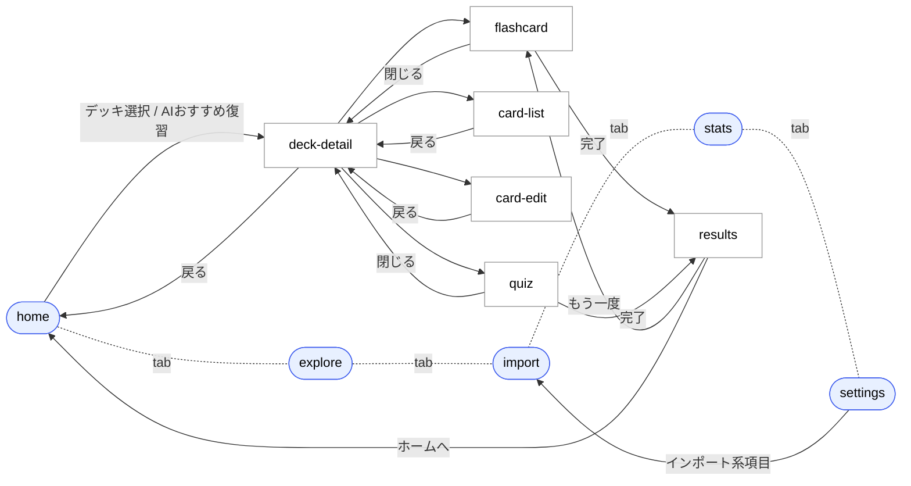

# 画面仕様書

> 11 画面と画面遷移の仕様。バックエンド着手時の API 抽出と、マルチプラットフォーム化（Capacitor / 別実装）の移植元として参照する想定です。
> プロダクト全体像は [product.md](./product.md)、データ構造は [data-model.md](./data-model.md) を参照してください。

---

## 1. ナビゲーション概要

画面遷移はすべて [../app/page.tsx](../app/page.tsx) の **ローカル state** (`screen`, `activeTab`, `previousScreen`) で擬似的に管理されています。`useState` の遷移以外に URL は変わりません。

- `Screen` 型（11 値）: `home` / `deck-detail` / `flashcard` / `quiz` / `results` / `explore` / `import` / `stats` / `settings` / `card-edit` / `card-list`
- `TabId` 型（5 値）: `home` / `explore` / `import` / `stats` / `settings`
- `tabScreens` に含まれる画面のみ下部タブが表示される

### 1.1 画面一覧表

| 画面 | `Screen` 値 | タブ表示 | タブ所属 | 主な目的 |
| --- | --- | :---: | --- | --- |
| ホーム | `home` | あり | `home` | 今日の進捗とデッキ一覧 |
| 探す | `explore` | あり | `explore` | 公開デッキの検索・追加 |
| 取込 | `import` | あり | `import` | 外部ソースから書き起こし → 単語登録 |
| 統計 | `stats` | あり | `stats` | 連続日数・週間学習量・苦手 TOP5 |
| 設定 | `settings` | あり | `settings` | プロフィール・各種設定 |
| デッキ詳細 | `deck-detail` | なし | — | 学習開始 / カード管理 |
| フラッシュカード | `flashcard` | なし | — | 1 枚ずつ学習 |
| 4 択クイズ | `quiz` | なし | — | 4 択での出題 |
| 結果 | `results` | なし | — | 学習完了後のサマリー |
| カード編集 | `card-edit` | なし | — | カード新規作成 / 編集 |
| カード一覧 | `card-list` | なし | — | デッキ内カードの検索・閲覧 |

### 1.2 画面遷移図



### 1.3 ボトムタブ

[../components/bottom-tabs.tsx](../components/bottom-tabs.tsx) で実装。

| ID | ラベル | アイコン | 特殊表示 |
| --- | --- | --- | --- |
| `home` | ホーム | `Home` | — |
| `explore` | 探す | `Search` | — |
| `import` | 取込 | `Plus` | **中央が一段上にせり出す**（`-mt-3`、プライマリ色の角丸ボックス） |
| `stats` | 統計 | `BarChart3` | — |
| `settings` | 設定 | `Settings` | — |

### 1.4 iPhone シェル

[../components/iphone-shell.tsx](../components/iphone-shell.tsx) は **開発時のプレビュー枠**（390x844、Dynamic Island 風の黒丸つき）。実機 / 実ブラウザ運用や Capacitor 化のときは外す前提。レイアウト依存はないので、`<div className="h-full flex flex-col">…</div>` だけ残せば中身は動く。

---

## 2. 画面ごとの仕様

各画面は `components/screens/<name>-screen.tsx`。

### 2.1 ホーム画面 — `home-screen.tsx`

[../components/screens/home-screen.tsx](../components/screens/home-screen.tsx)

**役割**: 学習エントリーポイント。今日のサマリーとデッキ一覧。

| 項目 | 内容 |
| --- | --- |
| Props | `onDeckSelect: (deckId: string) => void` |
| 内部 state | なし（すべてハードコード） |
| 表示要素 | ヘッダー / 今日のサマリーカード（`Today's Progress`、連続日数、復習待ち、苦手、習得率）/ AI おすすめ復習ボタン / デッキ一覧 |
| 主な操作 | デッキカード → `onDeckSelect(deck.id)` / AI おすすめ復習 → `onDeckSelect("1")` / 「すべて見る」 → 未実装 |
| データ項目 | デッキ: `id` / `name` / `cards` / `mastered` / `dueToday` / `color` / `template`。集計: `totalDueToday`（合計）/ `todayCards = 47` / `streak = 12` / 「苦手 8」「習得率 67%」は固定値 |

**注**: 現状 `app/page.tsx` 側の `onDeckSelect` は引数を捨てて `navigate("deck-detail")` するだけ。**バックエンド導入時に `deckId` を経路に乗せる必要あり**。

### 2.2 デッキ詳細 — `deck-detail-screen.tsx`

[../components/screens/deck-detail-screen.tsx](../components/screens/deck-detail-screen.tsx)

**役割**: 1 つのデッキの統計と、学習・カード管理の起点。

| 項目 | 内容 |
| --- | --- |
| Props | `onBack` / `onStartFlashcard` / `onStartQuiz` / `onCardEdit` / `onCardList` |
| 内部 state | なし |
| 表示要素 | ヘッダー（戻る / 三点）/ デッキタイトル + テンプレート / 統計（復習待ち / 苦手数 / 習得率）/ 進捗バー / 学習開始ボタン（フラッシュカード / 4 択クイズ）/ カード一覧プレビュー（8 件） |
| 主な操作 | フラッシュカード / クイズ / 一覧表示 / カード追加（編集画面へ）/ カード行タップ → 編集 |
| データ項目 | デッキ単体: `name` / `template` / `totalCards`（`800` 固定）/ `mastered`（`342` 固定）/ `dueToday`（`24` 固定）。プレビューカード: `id` / `word` / `meaning` / `mastery (1-5)` / `flagged` |

**ヘルパ**: `getMasteryColor(level)` と `getMasteryLabel(level)` がカード一覧プレビューと配色の対応を持つ（同一定義が `card-list-screen.tsx` にも複製されている）。

### 2.3 フラッシュカード学習 — `flashcard-screen.tsx`

[../components/screens/flashcard-screen.tsx](../components/screens/flashcard-screen.tsx)

**役割**: カードを 1 枚ずつ表面 / 裏面で学習。スワイプで前後移動。

| 項目 | 内容 |
| --- | --- |
| Props | `onClose` / `onComplete` |
| 内部 state | `currentIndex` / `isFlipped` / `starred: Record<id, bool>` / `showWord` / `showMeaning` / `showExample` / `memos: Record<id, string>` / `slideClass`（CSS クラス名） |
| 表面の構成 | 上部: お気に入り / カード ID / カテゴリ。中央 3 段: **単語 + 発音**、**品詞 + 意味**、**例文（ハイライト）+ 訳**。各段に表示/非表示トグル、単語段はリセットボタン。下部: ページネーション / 詳細トグル |
| 裏面の構成 | 「詳細情報」バッジ / 意味の根本イメージ / 意味（複数定義）/ 他の品詞 / フレーズ / 同じ語源の単語 / 間違えやすい単語 / 語源 + 語呂合わせ / メモ（textarea） |
| ジェスチャ | タップ: フリップ / 左スワイプ: 次へ / 右スワイプ: 前へ。閾値 60px、垂直成分 1.5x 超で水平判定 |
| 補助 UI | 上部に「今日の学習 47 語 / 新規 12 語」（固定値） |
| 表示しているカードフィールド | `id` / `word` / `pronunciation` / `pos` / `meaning` / `category` / `example` / `exampleHighlight` / `exampleJa` / `definitions[]` / `phrases[]` / `etymology` / `mnemonic` / `rootImage` / `relatedWords[]` / `otherPos[]` / `confusables[]` |

**注意**: メモ・お気に入りはコンポーネント内 state のみで永続化なし。バックエンド着手時はカード ID をキーにユーザー固有データとして保存する必要あり。

### 2.4 4 択クイズ — `quiz-screen.tsx`

[../components/screens/quiz-screen.tsx](../components/screens/quiz-screen.tsx)

**役割**: 単語に対する正答を 4 択から選ぶ。

| 項目 | 内容 |
| --- | --- |
| Props | `onClose` / `onComplete` |
| 内部 state | `currentIndex` / `selectedAnswer` / `correctCount` / `showFeedback` |
| 表示要素 | ヘッダー（×ボタン / 正答数 / 進捗バー）/ 問題（単語）/ 4 択選択肢（A〜D）/ フィードバック（正解 → 次の問題、不正解 → 正解を表示） |
| データ項目 | `id` / `word` / `correctAnswer` / `options: string[4]`（5 問固定の `quizQuestions` 配列） |
| 完了条件 | `currentIndex` が最後に達した状態で「結果を見る」を押下 → `onComplete()` |

### 2.5 学習結果 — `results-screen.tsx`

[../components/screens/results-screen.tsx](../components/screens/results-screen.tsx)

**役割**: 学習セッションのサマリー表示。

| 項目 | 内容 |
| --- | --- |
| Props | `onRetry` / `onHome` |
| 内部 state | なし |
| 表示要素 | トロフィー / 「学習完了!」/ 統計 3 マス（正答率・学習枚数・苦手数）/ 習熟度の変化（カード単位の `from→to`）/ 苦手カード一覧 / アクション（もう一度・ホームへ） |
| データ項目 | 固定値 `totalCards = 5`、`correct = 4`、`weakCards: { word, meaning }[]`、`masteryChanges: { word, from, to }[]` |

**注**: いまの実装は **直前のクイズ / フラッシュカードの結果と無関係に常に同じ数値を表示**。実装時はセッション結果を引き渡すか、サーバーから取得する必要あり。

### 2.6 探す（公開デッキ） — `explore-screen.tsx`

[../components/screens/explore-screen.tsx](../components/screens/explore-screen.tsx)

**役割**: 公開デッキの一覧 / 検索 / カテゴリフィルタ。

| 項目 | 内容 |
| --- | --- |
| Props | なし |
| 内部 state | `selectedCategory: string`（既定 `"すべて"`）/ `searchQuery: string` |
| 表示要素 | ヘッダー + 検索ボックス / カテゴリチップの横スクロール（`["すべて", "英語", "資格", "ビジネス", "IT", "医学", "法学"]`）/ 「人気のデッキ」セクション / デッキカード一覧 |
| 主な操作 | カテゴリ切替（クライアント側で `filter`）/ 検索（`name` または `author` の部分一致）/ 「追加」ボタン → **未実装** |
| データ項目 | `id` / `name` / `author` / `cards` / `downloads` / `rating` / `category` |

DL 数は `1000` 以上で `12.4k` のように k 表記に整形して表示。

### 2.7 取込 — `import-screen.tsx`

[../components/screens/import-screen.tsx](../components/screens/import-screen.tsx)

**役割**: 外部ソース（PDF / Podcast / YouTube）から書き起こしを取得し、単語タップで辞書参照 / 登録する。**画面が 2 段階構成**になっている。

#### 2.7.1 ソース選択フェーズ（`showTranscript === false`）

| 項目 | 内容 |
| --- | --- |
| 内部 state | `selectedSource: "pdf" \| "podcast" \| "youtube" \| null` / `url` / `isAnalyzing` / `showTranscript` |
| 表示要素 | 3 種ソース選択カード / 入力欄（PDF はファイル選択 UI、Podcast / YouTube は URL 入力）/ 「書き起こしを取得」ボタン / 操作方法ガイド |
| 主な操作 | ソース選択 → 入力欄表示 → 「取得」ボタンで `setTimeout(1500)` 後に `showTranscript = true` |
| ソース定義 | `{ id, name, icon, color, inputType: "file" \| "url" }` の 3 件（`sources` 配列） |

#### 2.7.2 トランスクリプトビューア（`showTranscript === true`）

| 項目 | 内容 |
| --- | --- |
| 内部 state | `showJapanese` / `isPlaying` / `currentTime` / `activeLine` / `registeredWords: { word, sourceIndex }[]` / `popover: { word, lineIndex, x, y } \| null` / `meaningPreview: string \| null` |
| 表示要素 | ヘッダー（戻る / ソースバッジ / 和訳トグル）/ 登録数バー（「N 語選択済み」「デッキに登録」ボタン）/ トランスクリプト行（タイムスタンプ / 英文 / 日本語訳）/ 単語タップ時のポップオーバー（登録 / 辞書）/ 再生コントロール |
| 単語タップ | 半角記号を除去・lowercase 化した `cleanWord` で `mockMeanings` 参照。`registeredWords` に追加 / 削除（同 `word` + `sourceIndex` で一意） |
| 再生 | `setInterval(1000)` で `currentTime` を 1 秒進め、`activeLine` を更新。`totalDuration = 100` 秒 |
| トランスクリプト 1 行 | `{ time: number(秒), en: string, ja: string }` |
| 辞書 | `mockMeanings: Record<string, string>`（約 30 単語のハードコードマップ） |

**注**: 「デッキに登録」ボタンは現状 push 先がない。バックエンド側で `Card` 一括作成エンドポイントが必要になる想定。

### 2.8 統計 — `stats-screen.tsx`

[../components/screens/stats-screen.tsx](../components/screens/stats-screen.tsx)

**役割**: 学習統計の閲覧。

| 項目 | 内容 |
| --- | --- |
| Props | なし |
| 内部 state | なし |
| 表示要素 | サマリー 3 マス（連続日数 12 / 今週 307 / 平均正答率 78%）/ 週間チャート（曜日ごとの棒グラフ。最終要素=本日が強調）/ デッキ別習得率（4 デッキ）/ 苦手カード TOP 5 |
| データ項目 | `weeklyData: { day, cards, height }[]` / `weakCards: { word, meaning, ef, reviews }[]` / `deckStats: { name, mastery, total, color }[]` |

`ef`（Ease Factor）と `reviews` は SRS のメトリクス。詳細仕様は **TBD**（[data-model.md](./data-model.md#10-未確定事項tbd)）。

### 2.9 設定 — `settings-screen.tsx`

[../components/screens/settings-screen.tsx](../components/screens/settings-screen.tsx)

**役割**: 各種設定の閲覧 / 切り替え。インポート画面への導線も持つ。

| 項目 | 内容 |
| --- | --- |
| Props | `onImport?: () => void` |
| 内部 state | `darkMode: boolean` / `showImportModal: "new" \| "existing" \| null` |
| プロフィール表示 | 名前「Tanaka Yuki」、ステータス「Premium 会員」（固定） |
| セクション | アカウント / インポート / 学習設定 / 表示設定 / その他 |
| 「アカウント」項目 | プロフィール（`tanaka@email.com`）/ クラウド同期（有効）/ デバイス（2 台接続中） |
| 「インポート」項目 | 新規デッキを作成してインポート / 既存のデッキに追加 → モーダル表示 |
| 「学習設定」項目 | リマインダー（毎日 8:00）/ TTS 言語（英語 (US)） |
| 「表示設定」項目 | ダークモード（ローカル state のみ。**実テーマには未反映**） |
| 「その他」項目 | プライバシー / ヘルプ・フィードバック |
| その他 UI | ログアウトボタン / バージョン表示「FlashMind v1.0.0」 |
| インポートモーダル | 「新規」: デッキ名入力欄。「既存」: デッキ一覧（"TOEIC 頻出 800 語" 等の固定 3 件）。下部「インポート画面へ」ボタンで `onImport?.()` |

### 2.10 カード編集 — `card-edit-screen.tsx`

[../components/screens/card-edit-screen.tsx](../components/screens/card-edit-screen.tsx)

**役割**: 1 枚のカードを新規作成 / 編集する画面。

| 項目 | 内容 |
| --- | --- |
| Props | `onBack` |
| 内部 state | `word` / `meaning` / `example` / `etymology` / `memo` / `flagged` / `generatingMeaning` / `generatingEtymology` / `generatingExplanation` |
| 既定値 | `word="unprecedented"`、`meaning="前例のない、空前の"`、`example="an unprecedented economic crisis"`、`etymology=""`、`memo=""`、`flagged=false`（編集モード前提の値） |
| AI 生成ボタン | 各フィールドで `setTimeout(1500)` 後に固定文字列を流し込むモック（OpenAI API への置換が **TBD** — 現状 [/api/ai/generate](../app/api/ai/generate/route.ts) を呼ぶ実装は完成済み、UI 配線は未） |
| テンプレートバッジ | 「英単語拡張」固定表示 |
| 保存 | ヘッダー右の「保存」とフッターの「カードを保存」ボタン。**保存処理は未実装** |

### 2.11 カード一覧 — `card-list-screen.tsx`

[../components/screens/card-list-screen.tsx](../components/screens/card-list-screen.tsx)

**役割**: デッキ内カードの検索 / 一覧 / 表示列の切替。

| 項目 | 内容 |
| --- | --- |
| Props | `onBack` |
| 内部 state | `showMeaning`（既定 true）/ `showExample`（既定 false）/ `showExplanation`（既定 false）/ `showFilters`（既定 false）/ `searchQuery` / `filterFlagged` |
| データ項目 | `id` / `word` / `meaning` / `example` / `explanation` / `mastery (1-5)` / `flagged`（`allCards` 配列、10 件） |
| フィルタ | 検索: `word` の部分一致（lowercase）/ 苦手のみ: `flagged === true` |
| 表示列の切替 | 意味 / 例文 / 解説 の 3 列を独立に表示切替 |
| 並び順 | 配列順（明示的なソート指定なし） |

`getMasteryColor(level)` は `deck-detail-screen.tsx` と同一定義。共通化候補。

---

## 3. 共通の UI 約束ごと

### 3.1 習熟度の色

```
1 → bg-red-500       未学習
2 → bg-orange-500    学習中
3 → bg-amber-500     復習中
4 → bg-emerald-400   ほぼ暗記
5 → bg-emerald-600   完全暗記
```

複数画面で重複定義されている。共通モジュール化（例: `lib/mastery.ts`）すると見通しが良くなる。

### 3.2 デッキの色（Tailwind クラス）

`bg-blue-500` / `bg-emerald-500` / `bg-amber-500` / `bg-rose-500` などをデッキレコードに直接保持。テーマトークン化する場合は **TBD**。

### 3.3 アニメーションクラス

[../app/globals.css](../app/globals.css) と各画面の `<style jsx>` で定義:

- `animate-flip-in` — 詳細展開時の Y 軸回転
- `animate-slide-up` — モーダル / フィードバックの下からスライド
- `animate-pulse-soft` — AI 生成中ボタン
- `animate-slide-left` / `animate-slide-right` — フラッシュカード遷移（`flashcard-screen.tsx` 内のみ）

---

## 4. 画面追加 / リファクタリングのメモ

- 画面を追加する際は `Screen` 型 → `renderScreen()` の switch → 必要なら `tabScreens` を更新（[../CLAUDE.md](../CLAUDE.md) の手順を参照）
- 中長期では App Router の segment（`app/<screen>/page.tsx`）に分割し、`useState` の擬似ルーティングを廃止する想定（[../README.md](../README.md) のロードマップ）
- iPhone シェルは Capacitor 化のときに撤去 / 切替前提
- 重複している `getMasteryColor` / `getMasteryLabel` は `lib/mastery.ts` に集約予定（**未実施**）
